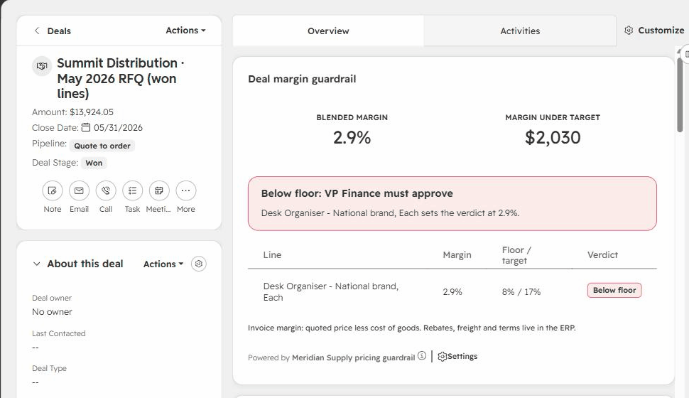
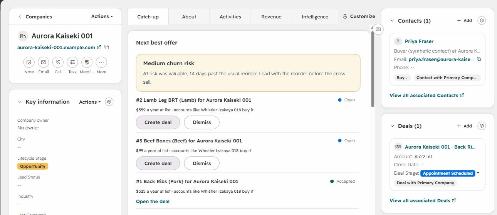
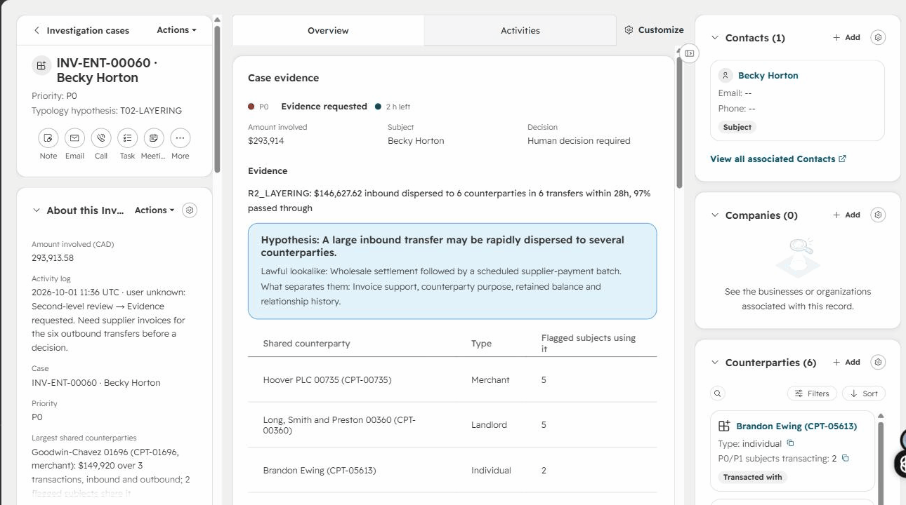
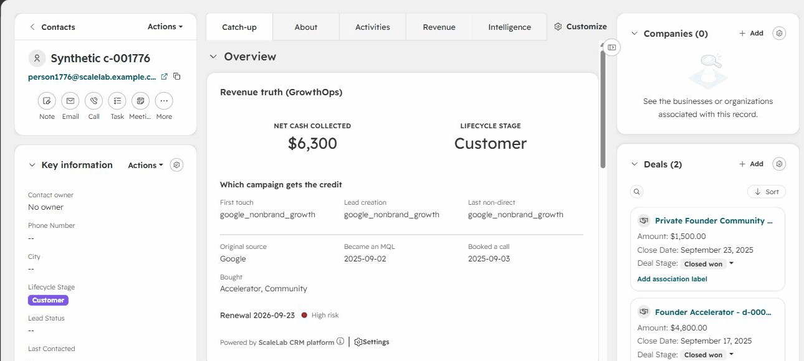
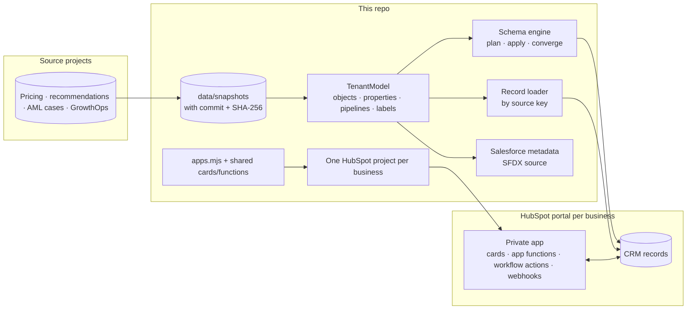

# HubSpot CRM Platform


**One codebase that runs four businesses' CRMs in HubSpot.** Each business is a project elsewhere in this
portfolio; here each one gets a HubSpot portal built from code: custom objects, pipelines, association labels and
records, loaded by the source system's key and proven to converge. Each portal also gets a private HubSpot app of
its own, with React cards on the records, app functions behind them, and custom workflow actions. The same data
model also compiles to Salesforce metadata, and Meridian's guardrail is written a third time in Apex with a Lightning
Web Component and a Flow, so the design is not tied to one CRM.

**Live in HubSpot, 1 October 2026.** Four developer test accounts on Enterprise tiers, one per business: 2,977
records and 3,393 associations loaded through each app's own token, every portal re-planned to zero writes; all four
cards working on real records; a HubSpot-delivered, signed webhook and a HubSpot workflow running the custom action,
both verified by the app functions. The record is in [live evidence](docs/live-evidence.md), generated from the
[evidence files](evidence/) the runs wrote.

| Deal margin guardrail (Meridian) | Next best offer, accepted into a deal (meat distributor) |
|---|---|
|  |  |
| **Case evidence (AML)** | **Revenue truth (ScaleLab)** |
|  |  |

Recordings: [accepting an offer](docs/images/crosssell-next-best-offer.gif) ·
[moving a case with a logged reason](docs/images/aml-case-evidence.gif) ·
[HubSpot's endpoint-function log](docs/images/scalelab-endpoint-function-log.png) (the signed workflow call and
webhooks accepted with 200, unsigned probes refused with 401).

| Business | Source project | In HubSpot | Its app |
|---|---|---|---|
| **ScaleLab**, a creator-led B2B education company | [GrowthOps OS](https://github.com/KushPatel29/GrowthOps-OS) | The portal GrowthOps already syncs two ways (961 contacts, 130 deals) | *Revenue truth* card on contacts; *Advance lifecycle stage (never backwards)* workflow action; signed webhook deliveries |
| **Meridian Supply**, a multi-category B2B wholesaler | [Pricing & Costing Analytics](https://github.com/KushPatel29/pricing-costing-analytics) | 150 accounts with buyers, 240 products, 359 deals from the Apr–Jun 2026 quote book, 480 line items | *Deal margin guardrail* card; *Check the price guardrail* workflow action that names who has to sign |
| **A specialty meat distributor** | [Customer Recommendation Engine](https://github.com/KushPatel29/Customer-Recommendation-Engine) | 120 accounts with account analytics, 38 products, and **Recommendation**, a custom object holding 302 eligible next-best offers | *Next best offer* card: accept an offer into a deal with its line item, or dismiss it with a reason |
| **AML investigations** (synthetic) | [Transaction Monitoring](https://github.com/KushPatel29/aml-transaction-monitoring) | **Investigation case** (366, with its own pipeline and deadline) and **Counterparty** (286), custom objects; subjects as contacts and companies | *Case evidence* card: deadline, typology hypothesis against its lawful lookalike, shared counterparties, audited stage moves |

## How it fits together



**CRM-as-code.** A `TenantModel` declares what a business needs in its CRM. The schema engine reads the portal,
plans the difference in dependency order (custom objects, then their properties, then pipelines, then association
labels), applies it, re-reads and plans again until nothing is left. It never deletes, renames or retypes: a
property the model does not declare is reported as drift and kept, a type change is a conflict for a person, and
enumeration options are merged, never removed.

**Records by the source system's key.** Every object carries `crm_platform_key`, the source identifier, so a
rerun updates what it created instead of duplicating it. Values are compared the way HubSpot stores them, so a
rerun plans zero writes. Fields people own after creation (a case's stage, an offer's status, a deadline's start)
are written once and never put back.

**Writes run inside HubSpot, under each app's own token.** A developer's personal access key can read the CRM but
not write standard records or their schemas, and HubSpot issues no local-dev app tokens on test accounts. Rather than
copy an app token out of HubSpot, each app carries a `provision` function: the loader sends it each API call signed
with a per-portal key it generated (HMAC over timestamp, method, path and body, five-minute window), and the function
makes the call with the token HubSpot gives the app. It allows only the calls the loader makes and never a DELETE.
No HubSpot credential leaves HubSpot. ([`provision.js`](hubspot/functions/provision.js))

**An app per business, from one library.** `hubspot/apps.mjs` says which cards, functions, workflow actions and
webhooks each portal gets, and with which scopes; `hubspot/build.mjs` generates one deployable HubSpot project
per business (platform 2026.09, private static-auth app). The functions share their business rules with the
cards and are bundled into single CommonJS files the way HubSpot loads them. CI fails if a generated project
drifts from its sources.

## What makes it production work, and the test that holds each

| Concern | What the platform does | Test |
|---|---|---|
| Reruns | Keyed records and value comparison as HubSpot stores them; a second apply and load writes nothing | `test_a_load_then_a_rerun_writes_nothing`, `test_apply_converges_and_a_second_apply_writes_nothing` |
| Destroying what people made | Drift is reported and kept; no deletes, renames or retypes; options merged | `test_a_portal_property_the_model_does_not_declare_is_drift_and_is_kept`, `test_a_retyped_property_is_a_conflict_not_a_change`, `test_options_are_merged_never_removed` |
| Overwriting people's decisions | Create-only fields: an accepted offer or a moved case is never reverted | `test_a_value_a_rep_changed_on_a_create_only_field_is_not_put_back` |
| Wrong portal | Test accounts only, and each business bound to one portal; the AML cases cannot land in ScaleLab | `test_a_tenant_bound_elsewhere_is_refused`, `test_only_test_accounts_are_written_unless_named` |
| Partial failures | HubSpot 207 batch errors recorded per record with HubSpot's category | `test_a_partial_batch_failure_is_reported_with_its_category` |
| Double clicks, races and retries | Accepting an offer writes a unique idempotency key on the deal (`offer-deal:<offer id>`), so HubSpot itself refuses a second deal; the deal and its line item are created already linked. One deal, one line item, whether two requests race, one runs twice or one fails part way (checked live: the duplicate is refused) | `makes one deal when two requests accept the same offer at once`, `turns an offer into one complete deal, even when clicked twice`, `resumes after a failure part way through instead of creating a second deal`, `adopts a deal that already carries the offer's key instead of creating another` |
| Duplicate records | Two records with one source key (products and line items cannot be unique) are reported, the oldest by `createdAt` is kept in step, and the portal does not count as converged until a person merges them | `test_two_records_with_one_key_are_reported_and_block_convergence` |
| Who really did it | A card action that records who acted is sent with `hubspot.fetch`, which HubSpot signs with the signed-in user in the URL; the function logs that name and ignores what the browser claims. While a portal's app has no client secret the private function is used instead and the log says "(unverified)" | `logs HubSpot's word for who moved a case when the card's request is signed`, `refuses a card request whose user, body or portal is not the one HubSpot signed`, `serves the actions that record who acted from signed endpoints, and the card calls them with hubspot.fetch` |
| An OAuth install going to the wrong place | The connector's install is accepted only with the `state` this run issued, and its refresh token is kept only if HubSpot says the token belongs to the tenant's bound portal; tokens live in the OS credential store and never reach an error or an evidence file | `test_the_callback_takes_a_code_only_with_the_state_this_run_issued`, `test_connect_keeps_the_refresh_token_only_when_the_install_is_in_the_tenants_portal`, `test_errors_carry_hubspots_code_and_never_a_secret_a_code_or_a_token`, `test_a_401_gets_one_new_token_and_one_retry_and_a_rotated_refresh_token_is_kept` |
| Forged workflow calls and webhooks | HubSpot v3 signatures verified (method, URI, body, timestamp; five-minute window) before anything is read | `refuses an unsigned or forged workflow request before touching the deal`, `accepts signed deliveries and logs a summary, never the payload values` |
| Two copies of a business rule | The guardrail runs in Python (loader) and JavaScript (HubSpot); a test runs both over all 359 Meridian deals | `test_python_and_javascript_score_every_meridian_deal_identically` |
| Lifecycle moving backwards | The workflow action moves a contact forward only (GrowthOps' field contract) | `moves forward, keeps backwards moves out, and says which` |
| Rate limits and outages | Paced under 100 requests per 10 seconds, `Retry-After` honoured, a circuit breaker | `test_retries_wait_at_least_as_long_as_retry_after`, `test_the_circuit_opens_after_repeated_exhausted_retries_and_closes_after_cooldown` |
| Leaking data or keys | Errors carry category, property names and correlation ID only; evidence files hold counts, never values | `test_errors_name_category_properties_and_correlation_never_values`, `test_apply_converges_and_the_evidence_has_counts_not_values` |
| What is deployed drifting from what is tested | Generated projects and Salesforce metadata rebuilt and compared in CI | `npm run check`, `test_generated_metadata_is_valid_and_committed` |
| A live portal drifting from its model | A nightly job plans every portal read-only through its provision function and fails if anything is left to do (it needs each portal's key as a repository secret; without one that portal is skipped) | `test_the_provision_key_can_come_from_the_environment_and_is_preferred_to_the_file`, [`live-verify.yml`](.github/workflows/live-verify.yml) |
| Three copies of the guardrail | Apex scores every Meridian deal in a fixture the Python guardrail generated, and must agree to 1e-9 (an Apex test: it runs in an org) | `test_the_apex_parity_fixture_is_every_meridian_deal_scored_by_the_python_guardrail`, `GuardrailServiceTest.everyMeridianDealScoresAsThePythonGuardrailDoes` |

## What the real API taught (each one found live, each now in the test double)

* Custom-object pipeline stages close on `metadata.state`, not `isClosed`; an `isClosed` sent directly is ignored.
* Association label names are unique across the whole portal, and an inverse label identical to the label is a 500.
* Products and line items share property groups and mirror each other's properties.
* There are no `crm.schemas.products.*` scopes; the `e-commerce` scope covers product and line-item settings.
* Public app functions are served at `https://<portal domain>/hs/serverless/<path>`; their secrets arrive in
  `process.env`; the gateway drops custom request headers; a secret saved blank must fail closed, and does.
* A card's property hook hands datetimes over formatted for display, so arithmetic on them (a case deadline) uses the
  API's raw values instead; private functions get no user identity, so the card passes the signed-in user.
* Offset paging on CRM search skips records edited mid-scan (from GrowthOps' sync): the loader reads by key.
* A duplicate unique value is refused with 400 `VALIDATION_ERROR`, not 409, so the idempotent create treats any
  refusal as "look it up by the key" rather than trusting one status code.
* Record IDs are not issued in creation order (a deal created today has a lower ID than yesterday's), so "oldest"
  means `createdAt`.

## Salesforce: the same model, and the guardrail in Apex

**Code** ([`salesforce/meridian/code`](salesforce/meridian/code), hand-written). Meridian's pricing guardrail on the
Salesforce platform, the twin of the HubSpot build:

* [`GuardrailService`](salesforce/meridian/code/main/default/classes/GuardrailService.cls): the rule in Apex, on
  doubles, so it can be held to the Python and JavaScript versions. Its test scores all 359 Meridian deals from a
  fixture the Python guardrail generated.
* [`OpportunityLineItemGuardrail`](salesforce/meridian/code/main/default/triggers/OpportunityLineItemGuardrail.trigger)
  and [`OpportunityGuardrail`](salesforce/meridian/code/main/default/classes/OpportunityGuardrail.cls): a trigger that
  only collects opportunity IDs, and a handler that rescores them with one query and one update whatever the batch
  size (tested with 200 opportunities in one transaction).
* [`dealMarginGuardrail`](salesforce/meridian/code/main/default/lwc/dealMarginGuardrail): a Lightning Web Component for
  the Opportunity page, the twin of the HubSpot Deal margin card, over an Apex controller that runs in user mode
  (field-level security enforced; its test runs as a sales user holding the permission sets, not as the admin).
* [`Meridian guardrail approval task`](salesforce/meridian/code/main/default/flows/Meridian_Guardrail_Approval_Task.flow-meta.xml):
  a record-triggered Flow that creates a task for the owner when an open opportunity needs a signature.

**Loader.** `python -m crm_platform.salesforce.load meridian --org <alias>` loads the same records by
`Crm_Platform_Key__c` and plans zero on a rerun, like the HubSpot loader. It is also the cross-system check: the loader
writes each opportunity's verdict as Python computed it, inserting the lines fires the Apex trigger, and a rerun that
plans nothing means the two agreed on every deal.

**What is checked where.** Locally and in CI: the component's Jest tests, an Apex syntax check (the ANTLR grammar the
Apex Dev Tools project keeps in step with the platform compiler), and the loader against an in-memory Salesforce.
In an org, because Apex compiles and runs nowhere else: the deploy itself and the 11 Apex tests.

**Run in an org (2026-10-02, a Developer Edition org).** 46 components deployed, 11 of 11 Apex tests passed,
including the 359-deal parity test, with every class at 93% coverage or more
([`salesforce_deploy.json`](evidence/meridian/salesforce_deploy.json)). The loader then created 150 accounts, 150
contacts, 240 products with their price-book entries, 359 opportunities and 480 lines in 12 bulk writes, and a rerun
plans zero ([`salesforce_first_load.json`](evidence/meridian/salesforce_first_load.json),
[`salesforce_load.json`](evidence/meridian/salesforce_load.json)).

**What the real org taught** (none of it visible to a parser or a test double):

* An Opportunity sales process cannot name a default stage ("Cannot specify a default on: Opportunity"); a Lead or
  Case process can. The generator wrote one.
* A `0.3` literal is a Decimal, and a Decimal argument does not widen to a Double parameter, though an Integer does.
  The guardrail's own test did not compile.
* The bulk test built 200 opportunities with a helper that queried the open stage each time: 101 queries, in the
  test, about a handler that uses one.
* Salesforce CLI 2.15x hides the session token in `sf org display` ("[REDACTED] ...") and hands it out from
  `sf org auth show-access-token`; the loader sent the notice as a bearer token and got `INVALID_AUTH_HEADER`.
* The cross-system check found a real disagreement on its first run, on 1 deal of 359: a blended margin of exactly
  0.53125. Apex's `HALF_UP` and JavaScript's `toFixed` say 0.5313; Python's formatter rounds a tie to even and said
  0.5312, so the loader and the trigger each saw the other's value as a change. The loader now breaks ties the way
  the other two do (`test_a_rounding_tie_goes_the_way_javascript_and_apex_send_it`), which also moved one line
  price from 20.62 to 20.63 in both CRMs.

**Metadata** (generated). `python -m crm_platform.salesforce.metadata` compiles the same models to SFDX source format under
[`salesforce/`](salesforce): custom objects and fields, `crm_platform_key` as an external ID for upserts, picklists
from enumerations, the deal pipeline as an Opportunity sales process, a custom object's pipeline as a `Stage__c`
picklist, association labels as lookups (custom to standard) or junction objects with two master-detail fields
(custom to custom). The model's naming rules are the intersection of both CRMs' (lower snake case, at most 40
characters, no `hs_` prefix), so every name compiles to both. HubSpot's own cost-of-goods property becomes a
`Unit_Cost__c` currency field, and each tenant gets a permission set granting its fields (a deploy grants none). The
output is parsed and checked against Salesforce's API-name rules in the tests.

## Run it

```bash
python -m pip install -e . -r requirements-dev.txt && npm install && npm install --prefix hubspot
python -m pytest -q                       # model, engine, both loaders, CLI, Salesforce compilation, JS parity
npm test --prefix hubspot                 # cards (HubSpot's test renderer), functions, signatures, bundles
npm install --prefix salesforce/meridian && npm run check --prefix salesforce/meridian   # LWC tests, Apex syntax

npx hs account auth --account <parent> --name dev        # the only credential step: typed into the CLI's prompt
npx hs test-account create -a dev --name "Meridian Supply" --sales-level ENTERPRISE ...
python -m crm_platform bind meridian --account meridian-supply           # pin the tenant; find its function domain
python -m crm_platform provision-key meridian --account meridian-supply  # per-portal signing key, never printed
cd hubspot && npm run build && cd projects/meridian && npx hs project upload --profile live && npx hs project install-app --profile live
python -m crm_platform apply meridian     # converge the schema, load the records, verify: through the app

python -m pip install -e .[oauth]         # the other way in: the OAuth connector app
python -m crm_platform oauth-secret connector    # the client secret, from the clipboard to the OS credential store
python -m crm_platform connect meridian          # approve the install in the browser; the refresh token is stored
python -m crm_platform verify meridian --via oauth
```

The full sequence, from creating a test account to watching webhook deliveries, and the Salesforce deploy, is in
the [runbook](docs/runbook.md).

## Not done, on purpose or not yet

* The Meridian *Check the price guardrail* workflow action is deployed but has not run in a live workflow: its
  function needs that app's client secret, which a person enters, and until then it refuses every call (401). The
  same verification path ran live in ScaleLab's action.
* The per-portal apps are private, static-auth apps (the agency pattern). The OAuth side is the **connector**
  ([`hubspot/projects/connector`](hubspot/projects/connector), [`oauth.py`](crm_platform/hubspot/oauth.py)): an OAuth
  app deployed to a test account, with the install flow, token refresh and a client transport tested against a
  stand-in for HubSpot's token endpoint. It has not been installed and run against the real one yet: that takes a
  person approving the install and copying the client secret. It is private distribution, not a marketplace listing.
* Salesforce is deployed and loaded, by hand from the runbook. [`salesforce-org.yml`](.github/workflows/salesforce-org.yml)
  repeats the deploy and the Apex tests in CI once the org's auth URL is stored as a repository secret, which a
  person does; until then it reports that it skipped. The approval-task Flow is covered by an Apex test and has not
  yet created a task on the loaded data: it fires when an open opportunity's approver changes, and the load sets
  each approver once. The Lightning component is deployed but not yet placed on the Opportunity page.
* Verified identity is built and tested but switched on per portal: it needs that app's client secret, which a
  person enters. Until then that portal's cards use the private functions and its logs say "(unverified)", because
  the name is the card's word and a user with the browser console could pass someone else's. The signed request
  has not been exercised against HubSpot's real signer from a card yet (webhooks and workflow actions, which use
  the same v3 signature and the same verifier, have).
* The provision function's signed envelope is valid for five minutes, so a captured request could be replayed
  within that window over TLS; every call it allows is idempotent at the loader level (creates are keyed), and it
  never deletes.

## Data and honesty

Every business here is synthetic, generated in its source project, and each snapshot records the source commit
and file hashes ([manifest](data/snapshots/manifest.json)). Buyer contacts are invented (the source projects model
accounts, not people) and are labelled synthetic in their job title; their emails use reserved `example.com`
domains. The AML build is an educational simulation of case management, not a compliance tool: it never decides
or files anything, it records a person's decision with their reason.
