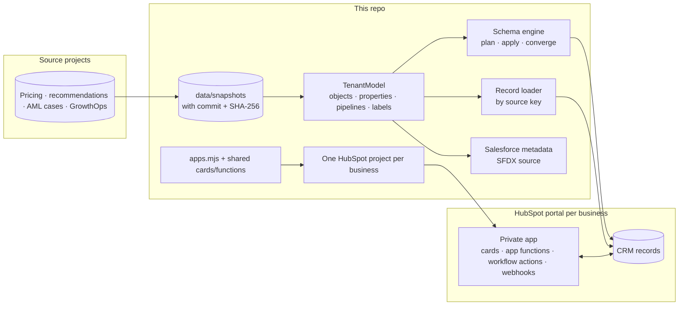

# HubSpot CRM Platform


**One codebase that runs four businesses' CRMs in HubSpot.** Each business is a project elsewhere in this
portfolio; here each one gets a HubSpot portal built from code: custom objects, pipelines, association labels and
records, loaded by the source system's key and proven to converge. Each portal also gets a private HubSpot app of
its own, with React cards on the records, app functions behind them, and custom workflow actions. The same data
model also compiles to Salesforce metadata, so the design is not tied to one CRM.

> **Status, 1 October 2026:** built and tested (83 Python and 37 JavaScript tests, CI on every push). The ScaleLab
> portal is live from GrowthOps OS; the Meridian, cross-sell and AML portals are being stood up in HubSpot developer
> test accounts, and their live evidence is added below as each one converges. Until then, the HubSpot column in the
> table describes what the code loads, verified against a strict HubSpot test double.

| Business | Source project | In HubSpot | Its app |
|---|---|---|---|
| **ScaleLab**, a creator-led B2B education company | [GrowthOps OS](https://github.com/KushPatel29/GrowthOps-OS) | The portal GrowthOps already syncs two ways (961 contacts, 130 deals) | *Revenue truth* card on contacts; *Advance lifecycle stage (never backwards)* workflow action; signed webhook deliveries |
| **Meridian Supply**, a multi-category B2B wholesaler | [Pricing & Costing Analytics](https://github.com/KushPatel29/pricing-costing-analytics) | 150 accounts with buyers, 240 products, 359 deals from the Apr–Jun 2026 quote book, 480 line items | *Deal margin guardrail* card; *Check the price guardrail* workflow action that names who has to sign |
| **A specialty meat distributor** | [Customer Recommendation Engine](https://github.com/KushPatel29/Customer-Recommendation-Engine) | 120 accounts with account analytics, 38 products, and **Recommendation**, a custom object holding 302 eligible next-best offers | *Next best offer* card: accept an offer into a deal with its line item, or dismiss it with a reason |
| **AML investigations** (synthetic) | [Transaction Monitoring](https://github.com/KushPatel29/aml-transaction-monitoring) | **Investigation case** (366, with its own pipeline and deadline) and **Counterparty** (286), custom objects; subjects as contacts and companies | *Case evidence* card: deadline, typology hypothesis against its lawful lookalike, shared counterparties, audited stage moves |

## How it fits together



**CRM-as-code.** A `TenantModel` declares what a business needs in its CRM. The schema engine reads the portal,
plans the difference in dependency order (custom objects, then their properties, then pipelines, then association
labels), applies it, re-reads and plans again until nothing is left. It never deletes, renames or retypes: a
property the model does not declare is reported as drift and kept, a type change is a conflict for a person, and
enumeration options are merged, never removed.

**Records by the source system's key.** Every object carries `crm_platform_key`, the source identifier, so a
rerun updates what it created instead of duplicating it. Values are compared the way HubSpot stores them, so a
rerun plans zero writes. Fields people own after creation (a case's stage, an offer's status, a deadline's start)
are written once and never put back.

**An app per business, from one library.** `hubspot/apps.mjs` says which cards, functions, workflow actions and
webhooks each portal gets, and with which scopes; `hubspot/build.mjs` generates one deployable HubSpot project
per business (platform 2026.09, private static-auth app). The functions share their business rules with the
cards and are bundled into single CommonJS files the way HubSpot loads them. CI fails if a generated project
drifts from its sources.

## What makes it production work, and the test that holds each

| Concern | What the platform does | Test |
|---|---|---|
| Reruns | Keyed records and value comparison as HubSpot stores them; a second apply and load writes nothing | `test_a_load_then_a_rerun_writes_nothing`, `test_apply_converges_and_a_second_apply_writes_nothing` |
| Destroying what people made | Drift is reported and kept; no deletes, renames or retypes; options merged | `test_a_portal_property_the_model_does_not_declare_is_drift_and_is_kept`, `test_a_retyped_property_is_a_conflict_not_a_change`, `test_options_are_merged_never_removed` |
| Overwriting people's decisions | Create-only fields: an accepted offer or a moved case is never reverted | `test_a_value_a_rep_changed_on_a_create_only_field_is_not_put_back` |
| Wrong portal | Test accounts only, and each business bound to one portal; the AML cases cannot land in ScaleLab | `test_a_tenant_bound_elsewhere_is_refused`, `test_only_test_accounts_are_written_unless_named` |
| Partial failures | HubSpot 207 batch errors recorded per record with HubSpot's category | `test_a_partial_batch_failure_is_reported_with_its_category` |
| Double clicks and retries | Accepting an offer is resumable: one deal, one line item, however many times it runs or fails part way | `turns an offer into one complete deal, even when clicked twice`, `resumes after a failure part way through instead of creating a second deal` |
| Forged workflow calls and webhooks | HubSpot v3 signatures verified (method, URI, body, timestamp; five-minute window) before anything is read | `refuses an unsigned or forged workflow request before touching the deal`, `accepts signed deliveries and logs a summary, never the payload values` |
| Two copies of a business rule | The guardrail runs in Python (loader) and JavaScript (HubSpot); a test runs both over all 359 Meridian deals | `test_python_and_javascript_score_every_meridian_deal_identically` |
| Lifecycle moving backwards | The workflow action moves a contact forward only (GrowthOps' field contract) | `moves forward, keeps backwards moves out, and says which` |
| Rate limits and outages | Paced under 100 requests per 10 seconds, `Retry-After` honoured, a circuit breaker | `test_retries_wait_at_least_as_long_as_retry_after`, `test_the_circuit_opens_after_repeated_exhausted_retries_and_closes_after_cooldown` |
| Leaking data or keys | Errors carry category, property names and correlation ID only; evidence files hold counts, never values | `test_errors_name_category_properties_and_correlation_never_values`, `test_apply_converges_and_the_evidence_has_counts_not_values` |
| What is deployed drifting from what is tested | Generated projects and Salesforce metadata rebuilt and compared in CI | `npm run check`, `test_generated_metadata_is_valid_and_committed` |

## Salesforce-ready

`python -m crm_platform.salesforce.metadata` compiles the same models to SFDX source format under
[`salesforce/`](salesforce): custom objects and fields, `crm_platform_key` as an external ID for upserts, picklists
from enumerations, the deal pipeline as an Opportunity sales process, a custom object's pipeline as a `Stage__c`
picklist, association labels as lookups (custom to standard) or junction objects with two master-detail fields
(custom to custom). The model's naming rules are the intersection of both CRMs' (lower snake case, at most 40
characters, no `hs_` prefix), so every name compiles to both. The output is parsed and checked against Salesforce's
API-name rules in the tests; it has not been deployed to a Salesforce org.

## Run it

```bash
python -m pip install -e . -r requirements-dev.txt && npm install && npm install --prefix hubspot
python -m pytest -q                       # model, engine, loader, CLI, Salesforce compilation, JS parity
npm test --prefix hubspot                 # cards (HubSpot's test renderer), functions, signatures, bundles
npx hs account auth                       # the only credential step: typed into the CLI's prompt
python -m crm_platform apply meridian --account "Meridian Supply"
```

The full sequence, from creating a test account to watching webhook deliveries, is in the
[runbook](docs/runbook.md).

## Data and honesty

Every business here is synthetic, generated in its source project, and each snapshot records the source commit
and file hashes ([manifest](data/snapshots/manifest.json)). Buyer contacts are invented (the source projects model
accounts, not people) and are labelled synthetic in their job title; their emails use reserved `example.com`
domains. The AML build is an educational simulation of case management, not a compliance tool: it never decides
or files anything, it records a person's decision with their reason.
